<div align="center">


# CineAI — Movie Discovery & Review Sentiment Analysis

**An intelligent, cinematic-grade movie recommendation engine powered by TF-IDF content filtering and Logistic Regression sentiment analysis — wrapped in a dark, streaming-style Streamlit UI.**

[](https://python.org)
[](https://streamlit.io)
[](https://scikit-learn.org)
[](https://www.themoviedb.org/)
[](LICENSE)

</div>

---

## Preview

<div align="center">

### Landing Page
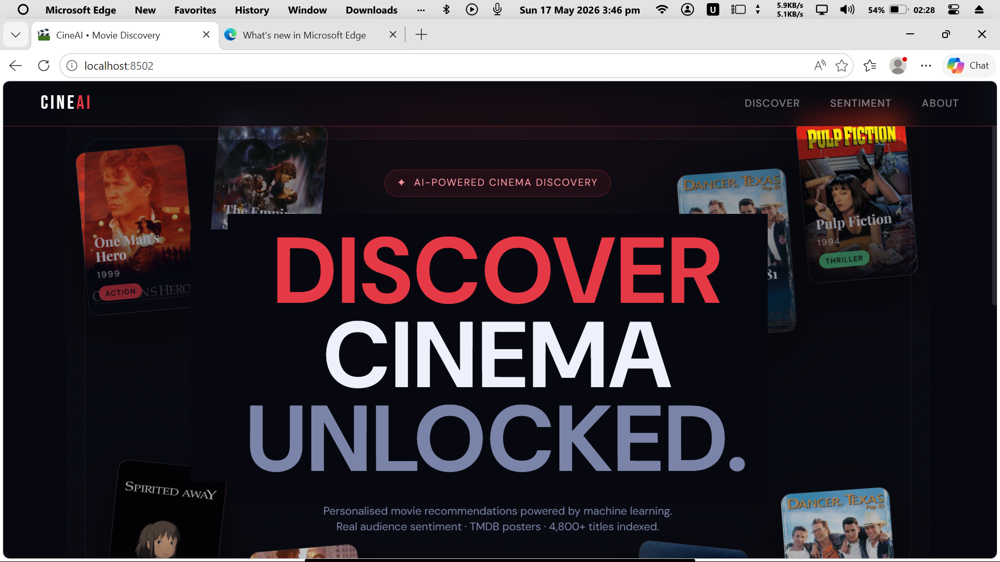

### Movie Discovery & Details
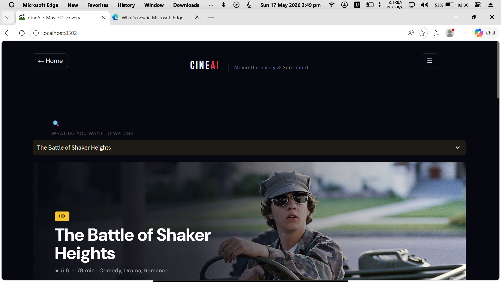

### Movie Overview & Cast
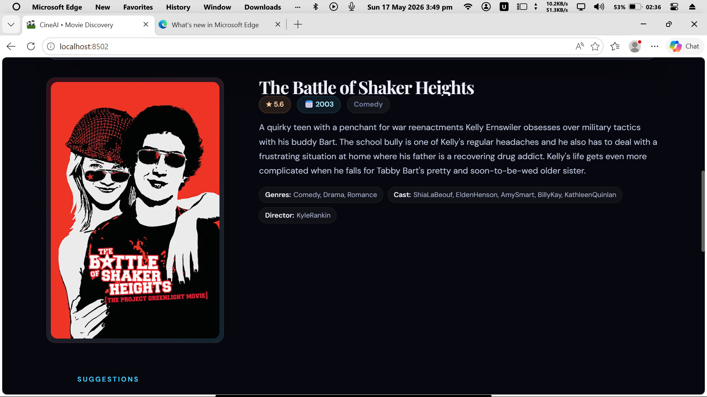

### Recommendation Grid
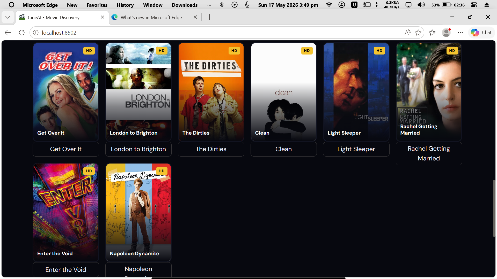

</div>

---

## Table of Contents

- [Overview](#overview)
- [Key Features](#key-features)
- [Tech Stack](#tech-stack)
- [Project Structure](#project-structure)
- [Exploratory Data Analysis](#exploratory-data-analysis)
- [Model Performance](#model-performance)
- [Setup & Installation](#setup--installation)
- [How to Run](#how-to-run)
- [Application Flow](#application-flow)
- [Dataset](#dataset)
- [Team](#team)

---

## Overview

**CineAI** is a full-stack Data Science project that solves two real-world problems simultaneously:

1. **Movie Discovery** — Users often struggle to find movies they'll enjoy. CineAI uses **content-based collaborative filtering** (TF-IDF + cosine similarity) to recommend movies based on metadata: genres, keywords, cast, director, and plot overview.

2. **Audience Sentiment** — Raw review counts don't tell you *how* audiences feel. CineAI fetches live TMDB reviews and classifies them as **Positive** or **Negative** using a **Logistic Regression** model trained on 50,000 IMDB reviews (89.57% accuracy).

The system is presented in a **dark cinematic Streamlit web app** with streaming-service aesthetics — animated hero banners, poster grids, cast cards, and live sentiment badges.

---

## Key Features

| Feature | Description |
|--------|-------------|
| **Smart Recommendations** | TF-IDF + cosine similarity across 4,800 movies |
| **Live Sentiment Analysis** | Real TMDB reviews classified as positive/negative |
| **Dynamic Hero Banners** | TMDB backdrop images with rating, runtime, genres |
| **Poster Grid** | Recommendations in Netflix-style card layout |
| **Advanced Filters** | Filter by genre, minimum rating, and result count |
| **Model Comparison** | Logistic Regression vs Naive Bayes benchmarks |
| **16 EDA Visualizations** | Genre trends, rating distributions, word clouds |
| **Cinematic Dark UI** | Custom CSS with glassmorphic cards and animations |

---

## Tech Stack

```
├── Web Framework      → Streamlit 1.25
├── ML / NLP           → scikit-learn 1.3 (TF-IDF, Logistic Regression, Naive Bayes)
├── Data Processing    → pandas 2.0, numpy 1.26
├── Visualization      → matplotlib 3.10, seaborn 0.13, plotly 6.7, wordcloud
├── NLP Preprocessing  → NLTK (PorterStemmer, stopwords)
├── Model Persistence  → joblib 1.3
├── External API       → TMDB API (posters + live reviews)
├── Environment        → python-dotenv
└── Notebooks          → Jupyter / JupyterLab
```

---

## Project Structure

```
movie-project/
│
├── WebApp.py                          # Main Streamlit application (~1900 CSS lines)
│
├── Notebooks/
│   ├── Recommendation_System_new.ipynb    # Full pipeline (11 sections)
│   └── Recommendation_System_clean.ipynb  # Clean skeleton version
│
├── Model/                             # Serialized ML artifacts
│   ├── movies_data.joblib             # Movie metadata (2.8 MB)
│   ├── similarity.joblib              # 4800×4800 cosine matrix (176 MB)
│   ├── sentiment_analysis_model.pkl   # Logistic Regression (79 KB)
│   └── tfidf_vectorizer.pkl           # TF-IDF vectorizer (55 MB)
│
├── EDA_plots/                         # 16 analysis visualizations
│   ├── 01_genre_distribution.png
│   ├── 02_budget_vs_revenue.png
│   └── ... (16 plots total)
│
├── screenshots/                       # App UI screenshots
│
├── Data/
│   ├── tmdb_5000_movies.csv           # Raw TMDB dataset (4,803 movies)
│   ├── tmdb_5000_credits.csv          # Cast & crew data
│   ├── cleaned_movies.csv             # Preprocessed with tags column
│   └── IMDB Dataset.csv              # 50K reviews for sentiment training
│
├── regenerate_models.py               # Rebuild all model artifacts
├── test_models.py                     # Verify model loading
├── requirements.txt                   # All dependencies
├── .streamlit/config.toml             # Dark cinematic theme config
└── .env                               # TMDB API key (not tracked)
```

---

## Exploratory Data Analysis

> 16 visualizations generated from the TMDB 5000 dataset and IMDB review corpus.

<table>
  <tr>
    <td align="center"><strong>Genre Distribution</strong><br/>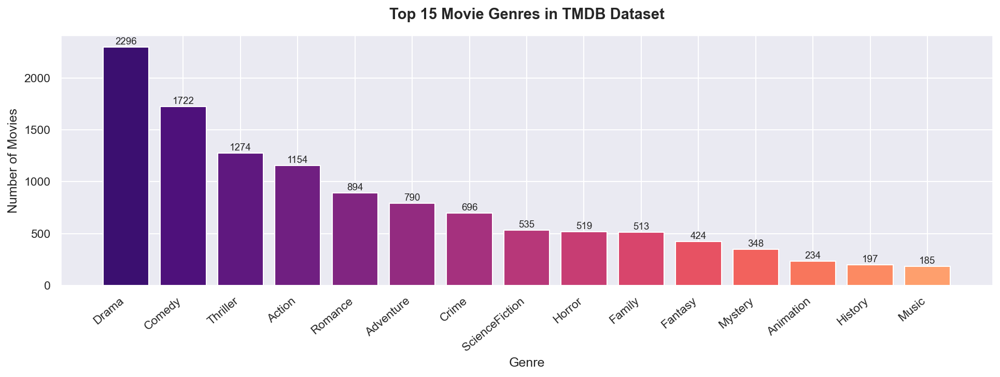</td>
    <td align="center"><strong>Budget vs Revenue</strong><br/>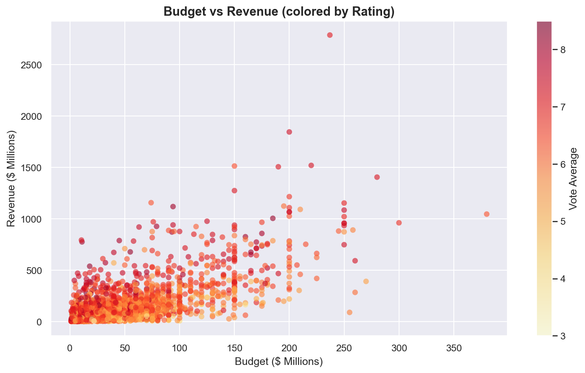</td>
  </tr>
  <tr>
    <td align="center"><strong>Rating Distribution</strong><br/>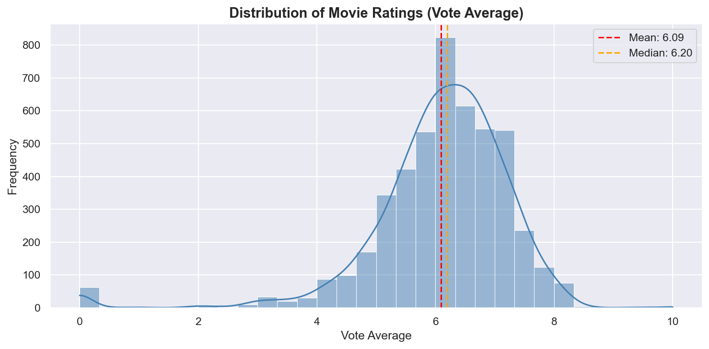</td>
    <td align="center"><strong>Movies Per Year</strong><br/>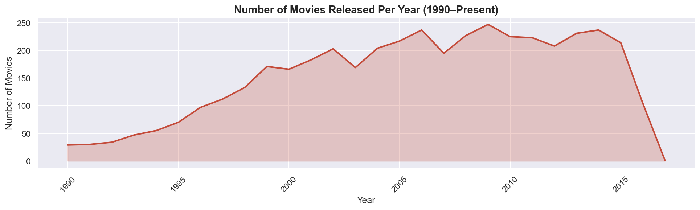</td>
  </tr>
  <tr>
    <td align="center"><strong>Top 10 Popular Movies</strong><br/>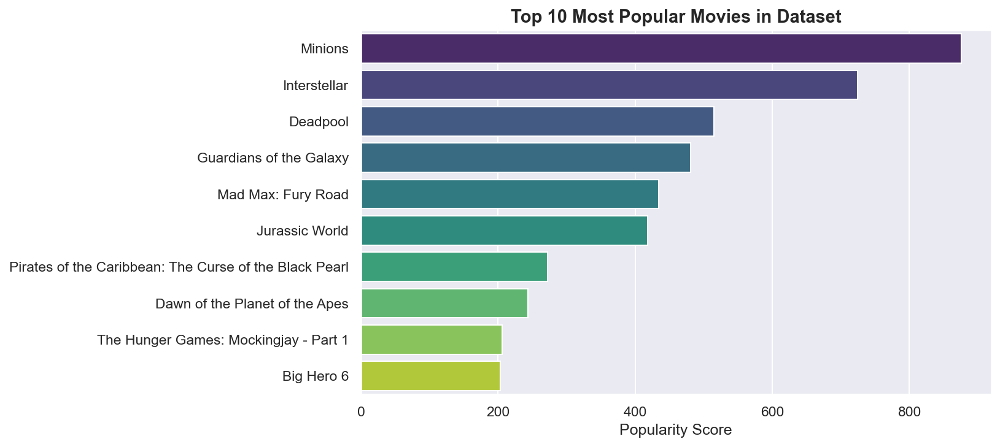</td>
    <td align="center"><strong>Popularity vs Rating</strong><br/>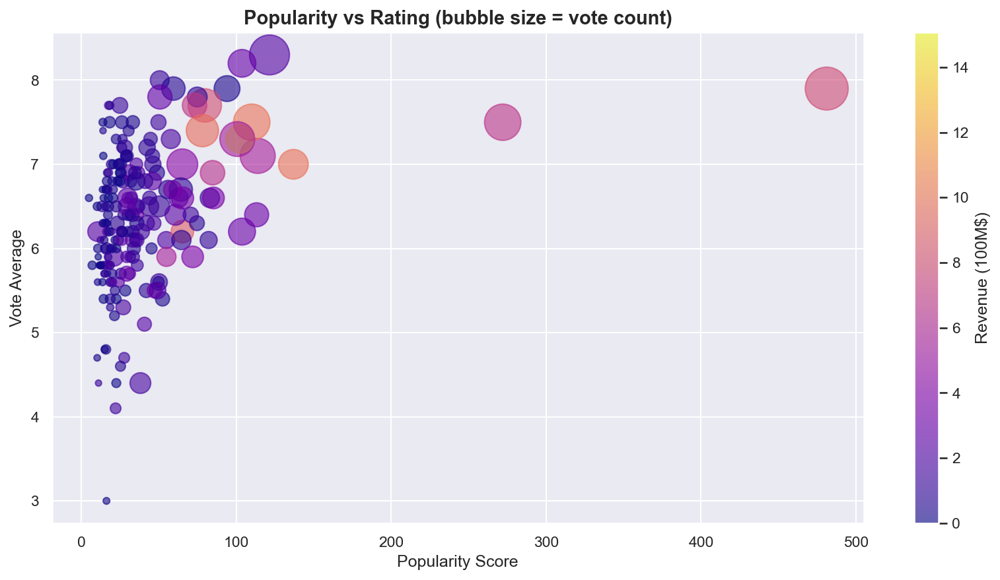</td>
  </tr>
  <tr>
    <td align="center"><strong>Keyword Word Cloud</strong><br/>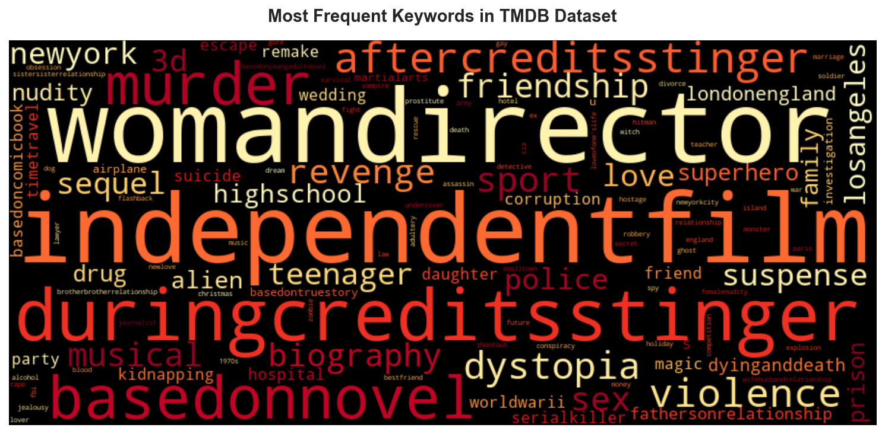</td>
    <td align="center"><strong>Correlation Heatmap</strong><br/>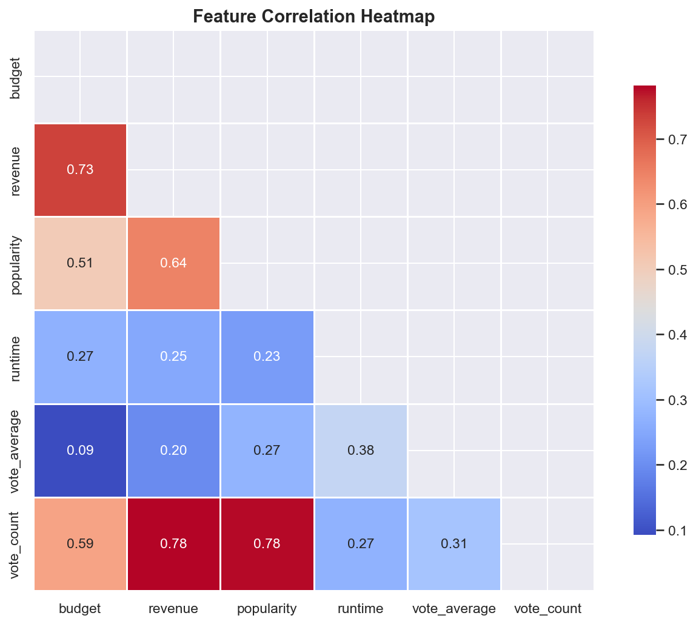</td>
  </tr>
</table>

### Sentiment Analysis Visualizations

<table>
  <tr>
    <td align="center"><strong>Sentiment Distribution</strong><br/>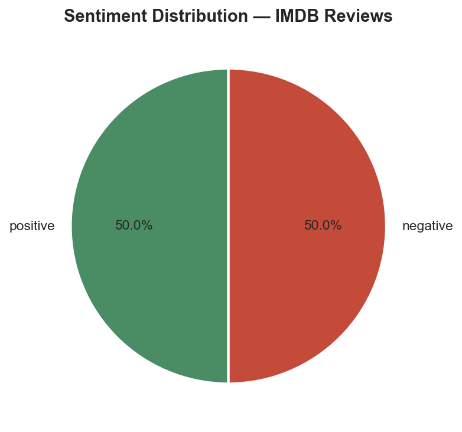</td>
    <td align="center"><strong>Review Wordclouds</strong><br/>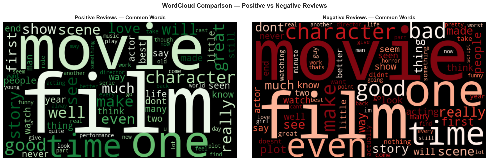</td>
  </tr>
  <tr>
    <td align="center"><strong>ROC Curves — LR vs NB</strong><br/>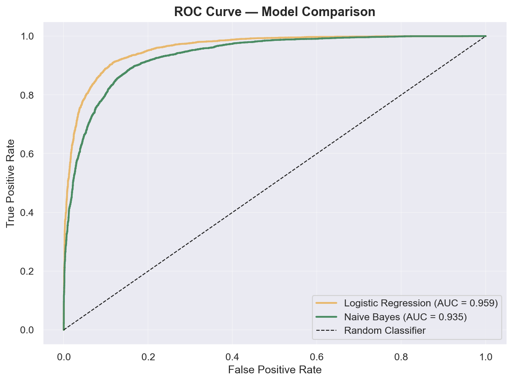</td>
    <td align="center"><strong>Model Metric Comparison</strong><br/>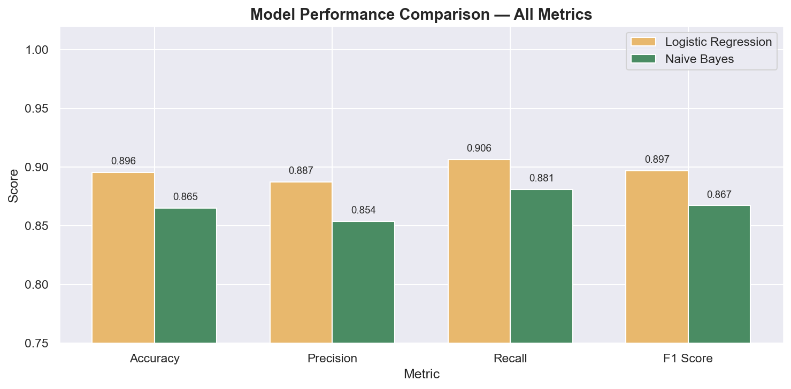</td>
  </tr>
  <tr>
    <td align="center" colspan="2"><strong>Confusion Matrices</strong><br/>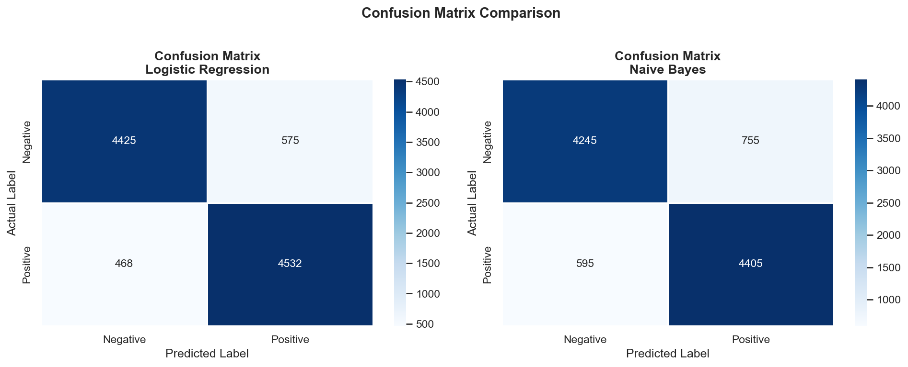</td>
  </tr>
</table>

---

## Model Performance

### Recommendation System

| Component | Detail |
|-----------|--------|
| Algorithm | Content-Based Filtering |
| Vectorizer | TF-IDF (5,000 features, English stop words) |
| Similarity | Cosine similarity (linear kernel on sparse matrix) |
| Corpus | 4,800 movies — genres + keywords + cast + director + overview |

### Sentiment Analysis

| Model | Accuracy | Precision | Recall | F1 Score |
|-------|----------|-----------|--------|----------|
| **Logistic Regression** | **89.57%** | **0.8874** | **0.9064** | **0.8968** |
| Naive Bayes | 86.50% | 0.8537 | 0.8810 | 0.8671 |

> Logistic Regression selected as the production model based on superior F1 and AUC scores.

**Training Data:** 50,000 IMDB reviews (balanced: 25K positive, 25K negative)  
**Features:** TF-IDF with bigrams, 10,000 vocabulary features  
**Split:** 80/20 train/test, stratified

---

## Setup & Installation

### Prerequisites
- Python 3.9+
- TMDB API key (free at [themoviedb.org](https://www.themoviedb.org/settings/api))

### 1. Clone the Repository

```bash
git clone https://github.com/Castro-Qadri/Data-Science-Movie-Recommendation-with-Review-Sentiment-Analysis.git
cd Data-Science-Movie-Recommendation-with-Review-Sentiment-Analysis
```

### 2. Create a Virtual Environment

```bash
python -m venv venv

# Windows
venv\Scripts\activate

# macOS/Linux
source venv/bin/activate
```

### 3. Install Dependencies

```bash
pip install -r requirements.txt
```

### 4. Configure Environment

Create a `.env` file in the project root:

```env
API_KEY=your_tmdb_api_key_here
```

### 5. Download NLTK Data

```python
import nltk
nltk.download('stopwords')
nltk.download('punkt')
```

---

## How to Run

### Run the Streamlit Web App

```bash
streamlit run WebApp.py
```

Open your browser at **http://localhost:8501**

### Regenerate Model Artifacts

If you need to rebuild the models from source data:

```bash
python regenerate_models.py
```

### Verify Model Loading

```bash
python test_models.py
```

### Run the Jupyter Notebooks

```bash
jupyter notebook Recommendation_System_new.ipynb
```

---

## Application Flow

```
┌─────────────────────────────────────────────────────────────────┐
│                        CineAI Landing Page                       │
│              (Animated floating poster cards + hero)             │
└───────────────────────────┬─────────────────────────────────────┘
                            │  Click card / "Enter CineAI"
                            ▼
┌─────────────────────────────────────────────────────────────────┐
│                        App Discovery Page                        │
│                                                                   │
│  1. Search bar  →  Select any of 4,800 movies                    │
│  2. Sidebar filters  →  Genre | Min Rating | Result Count        │
│  3. Hero Banner  →  Backdrop + title + rating + runtime          │
│  4. Movie Card  →  Poster + overview + genres + cast + director  │
│  5. Recommendations Grid  →  8–12 similar movies                 │
│                                                                   │
│  Tabs:                                                            │
│  ├── Reviews & Sentiment  →  TMDB reviews + LR prediction        │
│  ├── How It Works         →  TF-IDF & cosine similarity explainer│
│  └── Model Status         →  Artifact loading status badges      │
└─────────────────────────────────────────────────────────────────┘
```

---

## Dataset

| Dataset | Source | Size | Description |
|---------|--------|------|-------------|
| TMDB 5000 Movies | [Kaggle](https://www.kaggle.com/datasets/tmdb/tmdb-movie-metadata) | 4,803 rows × 20 cols | Budget, revenue, genres, keywords, overview |
| TMDB 5000 Credits | [Kaggle](https://www.kaggle.com/datasets/tmdb/tmdb-movie-metadata) | 4,803 rows × 4 cols | Cast and crew (JSON format) |
| IMDB Reviews | [Kaggle](https://www.kaggle.com/datasets/lakshmi25npathi/imdb-dataset-of-50k-movie-reviews) | 50,000 reviews | Balanced sentiment labels |

**Preprocessing steps:**
- Merge movies + credits on movie ID
- Parse JSON columns (genres, keywords, cast, crew)
- Remove spaces from multi-word names (`"Science Fiction"` → `"ScienceFiction"`)
- Create unified `tags` column (genres + keywords + cast + director + overview)
- Apply Porter Stemmer for normalization
- TF-IDF vectorization for both recommendation and sentiment tasks

---

## Team

<div align="center">

| Member | Role |
|--------|------|
| **Muhammad Ahmad Ijaz** | Data Pipeline, EDA, Model Training |
| **Abubakar Amir** | Streamlit UI/UX, API Integration |
| **Muhammad Umer** | Sentiment Analysis, Model Evaluation |

**Course:** Data Science — Semester 6 (2026)  
**Group:** No. 3

</div>

---

<div align="center">

Built with Python, scikit-learn, and Streamlit · Powered by the TMDB API

</div>
